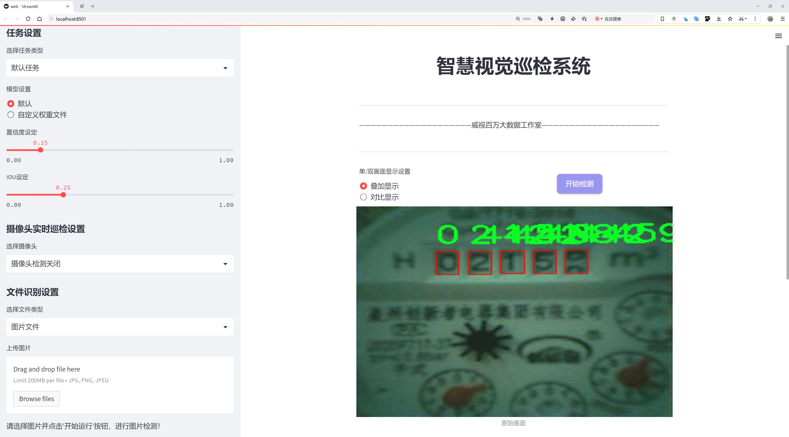
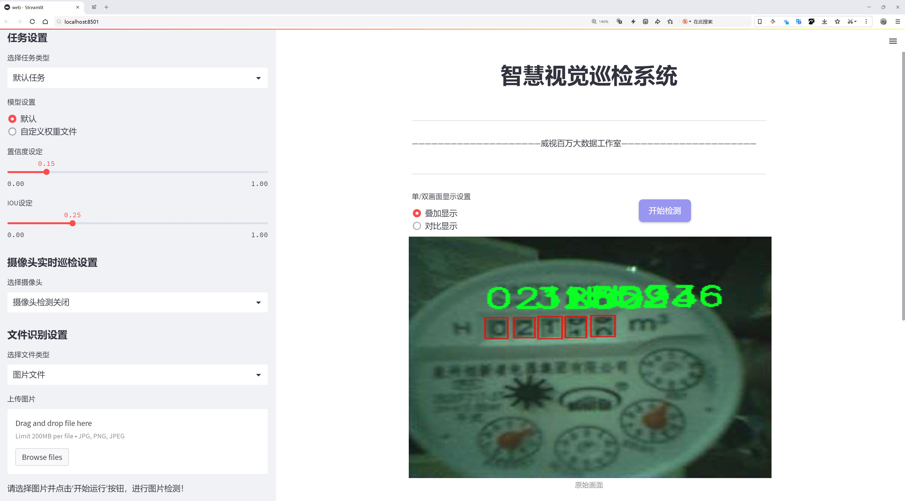
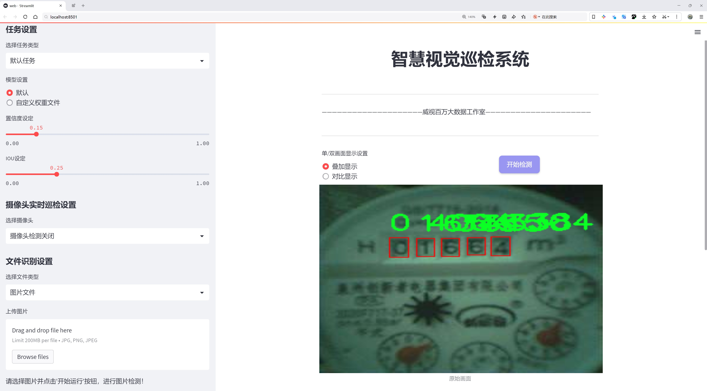
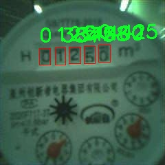
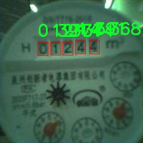
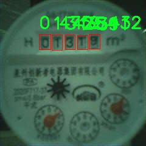
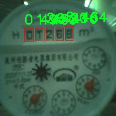
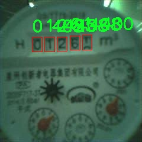

# 水表读数数字识别检测系统源码分享
 # [一条龙教学YOLOV8标注好的数据集一键训练_70+全套改进创新点发刊_Web前端展示]

### 1.研究背景与意义

项目参考[AAAI Association for the Advancement of Artificial Intelligence](https://gitee.com/qunmasj/projects)

项目来源[AACV Association for the Advancement of Computer Vision](https://kdocs.cn/l/cszuIiCKVNis)

研究背景与意义

随着智能城市和物联网技术的快速发展，传统的水表读数方式逐渐显露出其效率低下和人力成本高的问题。传统的人工抄表不仅耗时耗力，而且容易出现人为错误，导致数据不准确，影响水资源的管理与分配。因此，开发一种高效、准确的水表读数自动识别系统显得尤为重要。近年来，深度学习技术的迅猛发展为图像识别领域带来了新的机遇，尤其是基于卷积神经网络（CNN）的目标检测算法在各类视觉任务中表现出色。其中，YOLO（You Only Look Once）系列算法因其实时性和高准确率而受到广泛关注。

本研究旨在基于改进的YOLOv8模型，构建一个高效的水表读数数字识别系统。YOLOv8作为YOLO系列的最新版本，具有更高的检测精度和更快的推理速度，适合在实际应用中进行实时数据处理。通过对YOLOv8的改进，我们希望能够进一步提升其在水表数字识别任务中的表现，以适应复杂环境下的实际应用需求。

在本研究中，我们使用的数据集“seeed_meter_digit”包含3000张水表读数图像，涵盖了12个类别，具体包括数字0至9以及字母N。这一数据集的多样性和丰富性为模型的训练提供了良好的基础。通过对这些图像进行标注和分类，我们能够训练出一个具有较强泛化能力的模型，从而在不同的水表类型和环境条件下实现准确的数字识别。此外，数据集的规模和类别设置也为后续的模型评估和优化提供了充足的依据。

水表读数数字识别系统的研究不仅具有重要的学术价值，也具有广泛的实际应用前景。通过实现自动化的水表读数，我们可以显著提高水资源管理的效率，降低人工成本，减少人为错误。同时，该系统还可以与智能水务管理平台相结合，实现实时监控和数据分析，为水资源的合理利用提供科学依据。此外，随着智能家居和智慧城市的不断发展，水表读数数字识别系统的应用场景将不断扩展，未来有望在电表、气表等其他领域得到推广。

综上所述，基于改进YOLOv8的水表读数数字识别系统的研究，不仅能够推动计算机视觉技术在水务管理领域的应用，还能够为实现智能化的水资源管理提供有力支持。通过深入研究和优化该系统，我们期望能够为相关领域的研究者和实践者提供有价值的参考和借鉴，从而推动整个行业的技术进步与发展。

### 2.图片演示







##### 注意：由于此博客编辑较早，上面“2.图片演示”和“3.视频演示”展示的系统图片或者视频可能为老版本，新版本在老版本的基础上升级如下：（实际效果以升级的新版本为准）

  （1）适配了YOLOV8的“目标检测”模型和“实例分割”模型，通过加载相应的权重（.pt）文件即可自适应加载模型。

  （2）支持“图片识别”、“视频识别”、“摄像头实时识别”三种识别模式。

  （3）支持“图片识别”、“视频识别”、“摄像头实时识别”三种识别结果保存导出，解决手动导出（容易卡顿出现爆内存）存在的问题，识别完自动保存结果并导出到tempDir中。

  （4）支持Web前端系统中的标题、背景图等自定义修改，后面提供修改教程。

  另外本项目提供训练的数据集和训练教程,暂不提供权重文件（best.pt）,需要您按照教程进行训练后实现图片演示和Web前端界面演示的效果。

### 3.视频演示

[3.1 视频演示](https://www.bilibili.com/video/BV1CzsYeQEBF/)

### 4.数据集信息展示

##### 4.1 本项目数据集详细数据（类别数＆类别名）

nc: 11
names: ['0', '1', '2', '3', '4', '5', '6', '7', '8', '9', 'N']


##### 4.2 本项目数据集信息介绍

数据集信息展示

在现代智能水表读数数字识别系统的研究中，数据集的构建与选择至关重要。为实现对水表读数的高效识别与分类，我们采用了名为“seeed_meter_digit”的数据集。该数据集专门设计用于训练和改进YOLOv8模型，以提高其在水表数字识别任务中的准确性和鲁棒性。

“seeed_meter_digit”数据集包含11个类别，具体类别包括数字0至9，以及一个特殊类别“N”，用于表示未识别或无法读取的情况。这种设计不仅涵盖了水表上常见的数字，还考虑到了实际应用中可能遇到的各种异常情况，如模糊、污垢或损坏的读数。通过这种方式，数据集能够有效地模拟真实环境中的各种挑战，为模型的训练提供了丰富的样本。

在数据集的构建过程中，开发团队收集了大量的水表图像，这些图像来自不同品牌和型号的水表，涵盖了多种环境和光照条件。这种多样性确保了模型在面对不同类型水表时的适应能力，能够在各种条件下进行准确的数字识别。数据集中的每一张图像都经过精心标注，确保每个数字及其位置都被准确记录，这对于后续的模型训练至关重要。

此外，数据集的图像质量和分辨率也经过严格把控，以确保模型能够学习到清晰的特征。图像中的数字在不同的背景下呈现，包括干净的水表面、反光的玻璃以及各种可能的遮挡情况。这种设计不仅提高了模型的泛化能力，还增强了其在复杂场景下的识别性能。

在数据预处理阶段，团队还进行了数据增强，以增加数据集的多样性和丰富性。通过旋转、缩放、裁剪和颜色调整等技术，生成了多种变体，使得模型在训练过程中能够接触到更多样化的输入。这种策略有效地降低了模型对特定输入的依赖，提高了其在实际应用中的稳定性和可靠性。

“seeed_meter_digit”数据集的构建与使用，标志着在水表读数数字识别领域的一次重要进展。通过对YOLOv8模型的训练，研究团队期望能够实现更高的识别精度和更快的处理速度，为智能水表的普及和应用提供有力支持。随着技术的不断进步，未来的数据集可能会进一步扩展，包含更多类别和样本，以适应日益增长的市场需求和技术挑战。

总之，“seeed_meter_digit”数据集不仅为水表读数数字识别提供了坚实的基础，也为相关领域的研究者和开发者提供了宝贵的资源。通过对该数据集的深入分析与应用，研究团队希望能够推动智能水表技术的发展，为实现更智能化的水资源管理贡献力量。











### 5.全套项目环境部署视频教程（零基础手把手教学）

[5.1 环境部署教程链接（零基础手把手教学）](https://www.ixigua.com/7404473917358506534?logTag=c807d0cbc21c0ef59de5)


[5.2 安装Python虚拟环境创建和依赖库安装视频教程链接（零基础手把手教学）](https://www.ixigua.com/7404474678003106304?logTag=1f1041108cd1f708b01a)

### 6.手把手YOLOV8训练视频教程（零基础小白有手就能学会）

[6.1 手把手YOLOV8训练视频教程（零基础小白有手就能学会）](https://www.ixigua.com/7404477157818401292?logTag=d31a2dfd1983c9668658)

### 7.70+种全套YOLOV8创新点代码加载调参视频教程（一键加载写好的改进模型的配置文件）

[7.1 70+种全套YOLOV8创新点代码加载调参视频教程（一键加载写好的改进模型的配置文件）](https://www.ixigua.com/7404478314661806627?logTag=29066f8288e3f4eea3a4)

### 8.70+种全套YOLOV8创新点原理讲解（非科班也可以轻松写刊发刊，V10版本正在科研待更新）

由于篇幅限制，每个创新点的具体原理讲解就不一一展开，具体见下列网址中的创新点对应子项目的技术原理博客网址【Blog】：


[8.1 70+种全套YOLOV8创新点原理讲解链接](https://gitee.com/qunmasj/good)

### 9.系统功能展示（检测对象为举例，实际内容以本项目数据集为准）

图9.1.系统支持检测结果表格显示

  图9.2.系统支持置信度和IOU阈值手动调节

  图9.3.系统支持自定义加载权重文件best.pt(需要你通过步骤5中训练获得)

  图9.4.系统支持摄像头实时识别

  图9.5.系统支持图片识别

  图9.6.系统支持视频识别

  图9.7.系统支持识别结果文件自动保存

  图9.8.系统支持Excel导出检测结果数据


### 10.原始YOLOV8算法原理

原始YOLOv8算法原理

YOLOv8算法是目标检测领域的最新进展，代表了YOLO系列算法的又一次重大飞跃。其设计理念旨在兼顾检测精度与实时性，充分利用深度学习的优势，构建出一个高效、灵活且准确的目标检测框架。YOLOv8在多个方面进行了创新和优化，特别是在网络结构、损失函数以及样本匹配策略等方面，显著提升了目标检测的性能。

首先，YOLOv8的骨干网络依然采用了跨级结构（Cross Stage Partial, CSP）的思想，这种设计使得网络在保持较高的特征表达能力的同时，减少了计算复杂度。与前一版本YOLOv5相比，YOLOv8对C3模块进行了优化，采用了更为轻量的C2f结构。C2f模块的设计灵感来源于YOLOv7的ELAN结构，通过引入更多的分支和跨层连接，极大地丰富了梯度流，从而提升了特征的表示能力。这种优化不仅使得模型在训练时能够更有效地学习特征，还在推理时显著提高了速度。

在特征提取的过程中，YOLOv8保留了空间金字塔池化（SPP）模块，这一模块能够有效地处理不同尺度的目标，增强了模型对多尺度目标的检测能力。同时，YOLOv8在颈部网络中采用了路径聚合网络（Path Aggregation Network, PAN），这种结构能够有效地融合来自不同层次的特征信息，进一步提升了模型对目标的识别能力。

YOLOv8的头部网络设计上也进行了重要的改进。与传统的耦合头结构不同，YOLOv8采用了分类和检测过程的解耦设计。这种设计使得分类和回归的损失计算可以独立进行，从而提高了模型的训练效率和检测精度。在损失计算方面，YOLOv8引入了新的损失策略，包括变焦损失（Focal Loss）用于分类损失的计算，以及数据平均保真度损失和完美交并比损失（Complete Intersection over Union Loss）用于边界框损失的计算。这些新的损失函数能够更好地应对类别不平衡问题，提高模型对难以检测目标的敏感性。

在样本匹配策略上，YOLOv8引入了Task-Aligned Assigner策略，根据分类与回归的分数加权结果选择正样本。这种策略不仅提高了正负样本的分配效率，还使得模型在训练过程中能够更好地学习到目标的特征，从而提升了检测的准确性。

值得一提的是，YOLOv8在模型的轻量化方面也做出了显著贡献。根据不同的应用场景，YOLOv8提供了多个版本（如n、s、m、l、x），其中YOLOv8n版本的参数量最小，检测速度最快。这种灵活的设计使得YOLOv8能够适应各种实时性要求不同的应用场景，从而满足了实际应用中的多样化需求。

总的来说，YOLOv8算法通过一系列创新的设计和优化，成功地提升了目标检测的精度和速度。其在骨干网络、颈部网络和头部网络的结构改进，以及新的损失策略和样本匹配方法，使得YOLOv8在目标检测任务中表现出色。随着YOLOv8的推出，目标检测技术在智能监控、自动驾驶、医疗影像分析等领域的应用前景愈加广阔。未来，随着技术的不断进步，YOLOv8及其后续版本将有望在更多复杂场景中展现出更强的能力，为相关领域的发展提供更为有力的支持。


### 11.项目核心源码讲解（再也不用担心看不懂代码逻辑）

#### 11.1 ui.py

以下是对给定代码的核心部分进行保留和详细注释的版本：

```python
import sys
import subprocess

def run_script(script_path):
    """
    使用当前 Python 环境运行指定的脚本。

    Args:
        script_path (str): 要运行的脚本路径

    Returns:
        None
    """
    # 获取当前 Python 解释器的路径
    python_path = sys.executable

    # 构建运行命令，使用 streamlit 运行指定的脚本
    command = f'"{python_path}" -m streamlit run "{script_path}"'

    # 执行命令
    result = subprocess.run(command, shell=True)
    
    # 检查命令执行的返回码，若不为0则表示出错
    if result.returncode != 0:
        print("脚本运行出错。")

# 实例化并运行应用
if __name__ == "__main__":
    # 指定要运行的脚本路径
    script_path = "web.py"  # 这里可以直接指定脚本名称，假设在当前目录下

    # 调用函数运行脚本
    run_script(script_path)
```

### 代码分析与注释：

1. **导入模块**：
   - `sys`：用于访问与 Python 解释器相关的变量和函数。
   - `subprocess`：用于执行外部命令和程序。

2. **定义 `run_script` 函数**：
   - 此函数接受一个参数 `script_path`，表示要运行的 Python 脚本的路径。
   - 使用 `sys.executable` 获取当前 Python 解释器的路径，以确保使用相同的环境来运行脚本。
   - 构建命令字符串，使用 `streamlit` 模块运行指定的脚本。
   - 使用 `subprocess.run` 执行构建的命令，并通过 `shell=True` 允许在 shell 中执行命令。
   - 检查命令的返回码，如果返回码不为0，表示脚本运行出错，打印错误信息。

3. **主程序块**：
   - 使用 `if __name__ == "__main__":` 确保只有在直接运行该脚本时才会执行以下代码。
   - 指定要运行的脚本路径（这里假设脚本 `web.py` 在当前目录下）。
   - 调用 `run_script` 函数来执行指定的脚本。

### 总结：
该代码的核心功能是使用当前 Python 环境运行一个指定的脚本，并在运行过程中检查是否出现错误。

这个程序文件 `ui.py` 的主要功能是运行一个指定的 Python 脚本，具体来说是使用 Streamlit 框架来启动一个 Web 应用。程序首先导入了必要的模块，包括 `sys`、`os` 和 `subprocess`，以及一个自定义的 `abs_path` 函数，用于获取脚本的绝对路径。

在 `run_script` 函数中，首先获取当前 Python 解释器的路径，这通过 `sys.executable` 实现。接着，构建一个命令字符串，该命令使用当前的 Python 解释器来运行指定的脚本，命令的格式是 `python -m streamlit run "script_path"`。这里的 `script_path` 是传入的参数，表示要运行的脚本的路径。

随后，使用 `subprocess.run` 方法执行构建好的命令。这个方法会在新的子进程中运行命令，并等待其完成。如果命令执行后返回的状态码不为零，表示脚本运行出错，程序会打印出相应的错误信息。

在文件的最后部分，使用 `if __name__ == "__main__":` 来确保当该文件作为主程序运行时，以下代码才会被执行。这里指定了要运行的脚本路径为 `web.py`，并调用 `run_script` 函数来执行这个脚本。

总的来说，这个程序的核心功能是通过命令行调用 Streamlit 来启动一个 Web 应用，便于用户在浏览器中访问。

#### 11.2 code\ui.py

```python
import sys
import subprocess

def run_script(script_path):
    """
    使用当前 Python 环境运行指定的脚本。

    Args:
        script_path (str): 要运行的脚本路径

    Returns:
        None
    """
    # 获取当前 Python 解释器的路径
    python_path = sys.executable

    # 构建运行命令
    command = f'"{python_path}" -m streamlit run "{script_path}"'

    # 执行命令
    result = subprocess.run(command, shell=True)
    if result.returncode != 0:
        print("脚本运行出错。")


# 实例化并运行应用
if __name__ == "__main__":
    # 指定您的脚本路径
    script_path = "web.py"  # 这里可以直接指定脚本路径

    # 运行脚本
    run_script(script_path)
```

### 代码注释

1. **导入模块**：
   - `import sys`：导入 sys 模块，用于访问与 Python 解释器紧密相关的变量和函数。
   - `import subprocess`：导入 subprocess 模块，用于创建新进程、连接到它们的输入/输出/错误管道，并获取它们的返回码。

2. **定义函数 `run_script`**：
   - `def run_script(script_path):`：定义一个函数，接受一个参数 `script_path`，表示要运行的脚本的路径。

3. **获取 Python 解释器路径**：
   - `python_path = sys.executable`：获取当前 Python 解释器的完整路径，确保可以使用正确的 Python 环境来运行脚本。

4. **构建运行命令**：
   - `command = f'"{python_path}" -m streamlit run "{script_path}"'`：构建一个命令字符串，使用 `streamlit` 模块运行指定的脚本。

5. **执行命令**：
   - `result = subprocess.run(command, shell=True)`：使用 `subprocess.run` 执行构建的命令，`shell=True` 允许在 shell 中执行命令。

6. **检查执行结果**：
   - `if result.returncode != 0:`：检查命令的返回码，如果不为 0，表示脚本运行出错。
   - `print("脚本运行出错。")`：输出错误信息。

7. **主程序入口**：
   - `if __name__ == "__main__":`：确保只有在直接运行该脚本时才会执行以下代码。
   - `script_path = "web.py"`：指定要运行的脚本路径。
   - `run_script(script_path)`：调用 `run_script` 函数，运行指定的脚本。

这个程序文件的主要功能是使用当前的 Python 环境来运行一个指定的脚本，具体是通过 Streamlit 框架来启动一个 Web 应用。程序的第一部分导入了必要的模块，包括 `sys`、`os` 和 `subprocess`，以及一个自定义的 `abs_path` 函数，这个函数用于获取文件的绝对路径。

在 `run_script` 函数中，首先获取当前 Python 解释器的路径，使用 `sys.executable` 来实现。接着，构建一个命令字符串，这个命令会调用 Streamlit 来运行指定的脚本。命令的格式是 `"{python_path}" -m streamlit run "{script_path}"`，其中 `script_path` 是传入的参数，表示要运行的脚本的路径。

然后，使用 `subprocess.run` 来执行这个命令。`shell=True` 参数允许在 shell 中执行命令。如果命令执行后返回的状态码不为 0，表示脚本运行出错，程序会打印出相应的错误信息。

在文件的最后部分，使用 `if __name__ == "__main__":` 来判断是否是直接运行该脚本。如果是，则指定要运行的脚本路径，这里使用 `abs_path("web.py")` 来获取 `web.py` 文件的绝对路径，并调用 `run_script` 函数来执行这个脚本。

总的来说，这个程序的作用是方便地通过当前的 Python 环境来启动一个 Streamlit Web 应用，简化了手动运行的步骤。

#### 11.3 code\ultralytics\nn\modules\utils.py

以下是经过简化和注释的核心代码部分：

```python
import torch
import torch.nn.functional as F

def multi_scale_deformable_attn_pytorch(
    value: torch.Tensor,
    value_spatial_shapes: torch.Tensor,
    sampling_locations: torch.Tensor,
    attention_weights: torch.Tensor,
) -> torch.Tensor:
    """
    多尺度可变形注意力机制。

    参数:
    - value: 输入特征图，形状为 (批量大小, 通道数, 头数, 嵌入维度)
    - value_spatial_shapes: 特征图的空间形状，形状为 (层数, 2)
    - sampling_locations: 采样位置，形状为 (批量大小, 查询数, 头数, 层数, 采样点数, 2)
    - attention_weights: 注意力权重，形状为 (批量大小, 查询数, 头数, 层数, 采样点数)

    返回:
    - output: 输出特征图，形状为 (批量大小, 查询数, 头数 * 嵌入维度)
    """

    # 获取输入的维度信息
    bs, _, num_heads, embed_dims = value.shape
    _, num_queries, _, num_levels, num_points, _ = sampling_locations.shape

    # 将输入特征图按照空间形状拆分成多个特征图
    value_list = value.split([H_ * W_ for H_, W_ in value_spatial_shapes], dim=1)
    
    # 将采样位置转换到[-1, 1]的范围
    sampling_grids = 2 * sampling_locations - 1
    sampling_value_list = []

    # 遍历每一层特征图
    for level, (H_, W_) in enumerate(value_spatial_shapes):
        # 处理当前层的特征图
        value_l_ = value_list[level].flatten(2).transpose(1, 2).reshape(bs * num_heads, embed_dims, H_, W_)
        
        # 获取当前层的采样网格
        sampling_grid_l_ = sampling_grids[:, :, :, level].transpose(1, 2).flatten(0, 1)
        
        # 使用双线性插值进行采样
        sampling_value_l_ = F.grid_sample(
            value_l_, sampling_grid_l_, mode="bilinear", padding_mode="zeros", align_corners=False
        )
        sampling_value_list.append(sampling_value_l_)

    # 处理注意力权重的形状
    attention_weights = attention_weights.transpose(1, 2).reshape(
        bs * num_heads, 1, num_queries, num_levels * num_points
    )
    
    # 计算最终输出
    output = (
        (torch.stack(sampling_value_list, dim=-2).flatten(-2) * attention_weights)
        .sum(-1)
        .view(bs, num_heads * embed_dims, num_queries)
    )
    
    return output.transpose(1, 2).contiguous()  # 返回输出，调整维度顺序
```

### 代码注释说明：
1. **函数定义**：`multi_scale_deformable_attn_pytorch`函数实现了多尺度可变形注意力机制，输入包括特征图、空间形状、采样位置和注意力权重。
2. **维度获取**：提取输入张量的维度信息，方便后续处理。
3. **特征图拆分**：根据空间形状将输入特征图拆分为多个层次的特征图。
4. **采样位置转换**：将采样位置从[0, 1]范围转换到[-1, 1]范围，以适应`grid_sample`函数的要求。
5. **特征图处理**：遍历每一层特征图，使用`grid_sample`函数进行双线性插值采样，得到每一层的采样值。
6. **注意力权重处理**：调整注意力权重的形状，以便与采样值进行相乘。
7. **输出计算**：将所有层的采样值与注意力权重相乘并求和，得到最终输出特征图，并调整维度顺序。

这个程序文件是一个用于实现多尺度可变形注意力机制的工具模块，主要用于深度学习框架PyTorch中，特别是在Ultralytics YOLO模型中。代码中包含了一些常用的工具函数和初始化方法，下面对代码进行逐行讲解。

首先，导入了必要的库，包括`copy`、`math`、`numpy`和`torch`，以及PyTorch的神经网络模块`torch.nn`和其功能模块`torch.nn.functional`。这些库提供了深度学习所需的基本功能和数学运算。

接下来，定义了一个函数`_get_clones(module, n)`，该函数用于创建一个给定模块的克隆列表。它使用`copy.deepcopy`来确保每个克隆都是独立的，返回一个`nn.ModuleList`，这在构建神经网络时非常有用。

然后，定义了`bias_init_with_prob(prior_prob=0.01)`函数，用于根据给定的概率值初始化卷积或全连接层的偏置值。它通过对数几率的计算返回偏置的初始化值。

接着，`linear_init(module)`函数用于初始化线性模块的权重和偏置。它根据权重的形状计算边界值，并使用均匀分布初始化权重和偏置。

`inverse_sigmoid(x, eps=1e-5)`函数实现了反sigmoid函数的计算。它将输入张量限制在0到1之间，然后计算反sigmoid值，避免了数值不稳定的问题。

最后，`multi_scale_deformable_attn_pytorch`函数实现了多尺度可变形注意力机制。该函数接收四个参数：`value`、`value_spatial_shapes`、`sampling_locations`和`attention_weights`。函数内部首先获取输入张量的形状信息，并将`value`张量根据空间形状进行分割。接着，计算采样网格，并通过`F.grid_sample`函数对每个尺度的特征进行采样。最后，将采样值与注意力权重相乘并求和，得到最终的输出结果。

整体来看，这个模块提供了一些实用的工具函数和多尺度可变形注意力机制的实现，旨在提高模型的特征提取能力和性能。

#### 11.4 70+种YOLOv8算法改进源码大全和调试加载训练教程（非必要）\ultralytics\nn\extra_modules\afpn.py

以下是保留的核心代码部分，并附上详细的中文注释：

```python
import torch
import torch.nn as nn
import torch.nn.functional as F
from ..modules.conv import Conv

# 定义基本的卷积块
class BasicBlock(nn.Module):
    def __init__(self, filter_in, filter_out):
        super(BasicBlock, self).__init__()
        # 定义两个卷积层
        self.conv1 = Conv(filter_in, filter_out, 3)  # 第一个卷积层，卷积核大小为3
        self.conv2 = Conv(filter_out, filter_out, 3, act=False)  # 第二个卷积层，卷积核大小为3，不使用激活函数

    def forward(self, x):
        residual = x  # 保存输入以便后续与输出相加
        out = self.conv1(x)  # 通过第一个卷积层
        out = self.conv2(out)  # 通过第二个卷积层
        out += residual  # 残差连接
        return self.conv1.act(out)  # 返回经过激活函数处理的输出

# 定义上采样模块
class Upsample(nn.Module):
    def __init__(self, in_channels, out_channels, scale_factor=2):
        super(Upsample, self).__init__()
        # 定义上采样的卷积层和上采样操作
        self.upsample = nn.Sequential(
            Conv(in_channels, out_channels, 1),  # 1x1卷积
            nn.Upsample(scale_factor=scale_factor, mode='bilinear')  # 双线性插值上采样
        )

    def forward(self, x):
        return self.upsample(x)  # 直接返回上采样结果

# 定义下采样模块
class Downsample_x2(nn.Module):
    def __init__(self, in_channels, out_channels):
        super(Downsample_x2, self).__init__()
        # 定义2倍下采样的卷积层
        self.downsample = Conv(in_channels, out_channels, 2, 2, 0)  # 步幅为2

    def forward(self, x):
        return self.downsample(x)  # 直接返回下采样结果

# 定义自适应特征融合模块（ASFF）
class ASFF_2(nn.Module):
    def __init__(self, inter_dim=512):
        super(ASFF_2, self).__init__()
        self.inter_dim = inter_dim
        compress_c = 8  # 压缩通道数

        # 定义权重卷积层
        self.weight_level_1 = Conv(self.inter_dim, compress_c, 1)
        self.weight_level_2 = Conv(self.inter_dim, compress_c, 1)
        self.weight_levels = nn.Conv2d(compress_c * 2, 2, kernel_size=1)  # 计算融合权重
        self.conv = Conv(self.inter_dim, self.inter_dim, 3)  # 最后的卷积层

    def forward(self, input1, input2):
        # 计算每个输入的权重
        level_1_weight_v = self.weight_level_1(input1)
        level_2_weight_v = self.weight_level_2(input2)

        # 合并权重并计算最终的融合权重
        levels_weight_v = torch.cat((level_1_weight_v, level_2_weight_v), 1)
        levels_weight = self.weight_levels(levels_weight_v)
        levels_weight = F.softmax(levels_weight, dim=1)  # 归一化权重

        # 根据权重进行特征融合
        fused_out_reduced = input1 * levels_weight[:, 0:1, :, :] + \
                            input2 * levels_weight[:, 1:2, :, :]

        out = self.conv(fused_out_reduced)  # 通过卷积层
        return out  # 返回融合后的输出

# 定义主网络结构
class AFPN_P345(nn.Module):
    def __init__(self, in_channels=[256, 512, 1024], out_channels=256, factor=4):
        super(AFPN_P345, self).__init__()
        # 定义输入通道的卷积层
        self.conv0 = Conv(in_channels[0], in_channels[0] // factor, 1)
        self.conv1 = Conv(in_channels[1], in_channels[1] // factor, 1)
        self.conv2 = Conv(in_channels[2], in_channels[2] // factor, 1)

        # 定义网络主体
        self.body = BlockBody_P345([in_channels[0] // factor, in_channels[1] // factor, in_channels[2] // factor])

        # 定义输出通道的卷积层
        self.conv00 = Conv(in_channels[0] // factor, out_channels, 1)
        self.conv11 = Conv(in_channels[1] // factor, out_channels, 1)
        self.conv22 = Conv(in_channels[2] // factor, out_channels, 1)

    def forward(self, x):
        x0, x1, x2 = x  # 分别获取输入的三个特征图

        # 通过卷积层处理输入
        x0 = self.conv0(x0)
        x1 = self.conv1(x1)
        x2 = self.conv2(x2)

        # 通过主体网络处理
        out0, out1, out2 = self.body([x0, x1, x2])

        # 通过输出卷积层处理
        out0 = self.conv00(out0)
        out1 = self.conv11(out1)
        out2 = self.conv22(out2)
        return [out0, out1, out2]  # 返回处理后的输出
```

### 代码说明
1. **BasicBlock**: 这是一个基本的卷积块，包含两个卷积层和一个残差连接。
2. **Upsample**: 该模块用于上采样，使用1x1卷积和双线性插值。
3. **Downsample_x2**: 该模块用于2倍下采样，使用卷积层进行特征压缩。
4. **ASFF_2**: 自适应特征融合模块，计算输入特征的权重并进行融合。
5. **AFPN_P345**: 主网络结构，包含输入卷积层、特征融合模块和输出卷积层。该网络结构用于处理多尺度特征图并进行特征融合。

这个程序文件定义了一些用于YOLOv8算法改进的模块，主要涉及到特征金字塔网络（FPN）和自适应特征融合（ASFF）的实现。代码结构清晰，使用了PyTorch框架来构建神经网络模块。

首先，文件引入了一些必要的库，包括`torch`和`torch.nn`，并定义了一些基础模块，如`BasicBlock`、`Upsample`、`Downsample_x2`、`Downsample_x4`、`Downsample_x8`等。这些模块主要用于构建卷积层和进行上采样、下采样操作。

`BasicBlock`类实现了一个基本的残差块，其中包含两个卷积层，并通过残差连接将输入与输出相加，增强了网络的学习能力。`Upsample`和`Downsample`类则分别实现了上采样和下采样的功能，使用卷积层和双线性插值来调整特征图的尺寸。

接下来，`ASFF_2`、`ASFF_3`和`ASFF_4`类实现了自适应特征融合模块。它们通过计算不同输入特征图的权重，并根据这些权重对特征图进行加权融合，从而提升特征的表达能力。每个ASFF模块根据输入的数量不同而有所区别，分别支持2、3和4个输入特征图的融合。

`BlockBody_P345`和`BlockBody_P2345`类则实现了特定结构的网络体，分别用于处理3个和4个尺度的特征图。这些类通过组合前面定义的模块，构建了一个复杂的特征提取网络，能够在不同尺度上提取特征并进行融合。

此外，`AFPN_P345`和`AFPN_P2345`类实现了特征金字塔网络的整体结构。它们接收不同尺度的输入特征图，经过卷积和自适应特征融合后，输出融合后的特征图。这些类还包含了权重初始化的代码，以确保网络的训练稳定性。

最后，`BlockBody_P345_Custom`和`BlockBody_P2345_Custom`类允许用户自定义块的类型，通过传入不同的块类型，可以灵活地调整网络结构，以适应不同的任务需求。

总体来说，这个文件提供了一种灵活且高效的方式来构建和训练YOLOv8模型，利用自适应特征融合和特征金字塔的思想，增强了模型的性能和表达能力。

#### 11.5 70+种YOLOv8算法改进源码大全和调试加载训练教程（非必要）\ultralytics\nn\modules\transformer.py

以下是代码中最核心的部分，并附上详细的中文注释：

```python
import torch
import torch.nn as nn
import torch.nn.functional as F

class TransformerEncoderLayer(nn.Module):
    """定义一个Transformer编码器层。"""

    def __init__(self, c1, cm=2048, num_heads=8, dropout=0.0, act=nn.GELU(), normalize_before=False):
        """初始化TransformerEncoderLayer，指定参数。"""
        super().__init__()
        self.ma = nn.MultiheadAttention(c1, num_heads, dropout=dropout, batch_first=True)  # 多头自注意力机制
        self.fc1 = nn.Linear(c1, cm)  # 前馈网络的第一层
        self.fc2 = nn.Linear(cm, c1)  # 前馈网络的第二层
        self.norm1 = nn.LayerNorm(c1)  # 第一层归一化
        self.norm2 = nn.LayerNorm(c1)  # 第二层归一化
        self.dropout = nn.Dropout(dropout)  # dropout层
        self.dropout1 = nn.Dropout(dropout)  # 第一个dropout层
        self.dropout2 = nn.Dropout(dropout)  # 第二个dropout层
        self.act = act  # 激活函数
        self.normalize_before = normalize_before  # 是否在前向传播前进行归一化

    def forward(self, src, src_mask=None, src_key_padding_mask=None, pos=None):
        """通过编码器模块进行前向传播。"""
        if self.normalize_before:
            return self.forward_pre(src, src_mask, src_key_padding_mask, pos)  # 前归一化
        return self.forward_post(src, src_mask, src_key_padding_mask, pos)  # 后归一化

    def forward_post(self, src, src_mask=None, src_key_padding_mask=None, pos=None):
        """后归一化的前向传播。"""
        q = k = self.with_pos_embed(src, pos)  # 添加位置嵌入
        src2 = self.ma(q, k, value=src, attn_mask=src_mask, key_padding_mask=src_key_padding_mask)[0]  # 自注意力计算
        src = src + self.dropout1(src2)  # 残差连接
        src = self.norm1(src)  # 归一化
        src2 = self.fc2(self.dropout(self.act(self.fc1(src))))  # 前馈网络
        src = src + self.dropout2(src2)  # 残差连接
        return self.norm2(src)  # 最终归一化

    def forward_pre(self, src, src_mask=None, src_key_padding_mask=None, pos=None):
        """前归一化的前向传播。"""
        src2 = self.norm1(src)  # 先进行归一化
        q = k = self.with_pos_embed(src2, pos)  # 添加位置嵌入
        src2 = self.ma(q, k, value=src2, attn_mask=src_mask, key_padding_mask=src_key_padding_mask)[0]  # 自注意力计算
        src = src + self.dropout1(src2)  # 残差连接
        src2 = self.norm2(src)  # 归一化
        src2 = self.fc2(self.dropout(self.act(self.fc1(src2))))  # 前馈网络
        return src + self.dropout2(src2)  # 残差连接

    @staticmethod
    def with_pos_embed(tensor, pos=None):
        """如果提供了位置嵌入，则将其添加到张量中。"""
        return tensor if pos is None else tensor + pos


class AIFI(TransformerEncoderLayer):
    """定义AIFI Transformer层。"""

    def __init__(self, c1, cm=2048, num_heads=8, dropout=0, act=nn.GELU(), normalize_before=False):
        """初始化AIFI实例，指定参数。"""
        super().__init__(c1, cm, num_heads, dropout, act, normalize_before)

    def forward(self, x):
        """AIFI Transformer层的前向传播。"""
        c, h, w = x.shape[1:]  # 获取输入的通道数、高度和宽度
        pos_embed = self.build_2d_sincos_position_embedding(w, h, c)  # 构建2D位置嵌入
        x = super().forward(x.flatten(2).permute(0, 2, 1), pos=pos_embed.to(device=x.device, dtype=x.dtype))  # 调用父类的前向传播
        return x.permute(0, 2, 1).view([-1, c, h, w]).contiguous()  # 变换回原始形状

    @staticmethod
    def build_2d_sincos_position_embedding(w, h, embed_dim=256, temperature=10000.0):
        """构建2D正弦余弦位置嵌入。"""
        grid_w = torch.arange(int(w), dtype=torch.float32)  # 水平网格
        grid_h = torch.arange(int(h), dtype=torch.float32)  # 垂直网格
        grid_w, grid_h = torch.meshgrid(grid_w, grid_h, indexing='ij')  # 生成网格
        pos_dim = embed_dim // 4  # 位置维度
        omega = torch.arange(pos_dim, dtype=torch.float32) / pos_dim  # 计算频率
        omega = 1. / (temperature ** omega)  # 温度缩放

        out_w = grid_w.flatten()[..., None] @ omega[None]  # 水平位置嵌入
        out_h = grid_h.flatten()[..., None] @ omega[None]  # 垂直位置嵌入

        return torch.cat([torch.sin(out_w), torch.cos(out_w), torch.sin(out_h), torch.cos(out_h)], 1)[None]  # 返回嵌入


class TransformerLayer(nn.Module):
    """Transformer层，使用线性变换和多头注意力机制。"""

    def __init__(self, c, num_heads):
        """初始化自注意力机制。"""
        super().__init__()
        self.q = nn.Linear(c, c, bias=False)  # 查询线性变换
        self.k = nn.Linear(c, c, bias=False)  # 键线性变换
        self.v = nn.Linear(c, c, bias=False)  # 值线性变换
        self.ma = nn.MultiheadAttention(embed_dim=c, num_heads=num_heads)  # 多头自注意力机制
        self.fc1 = nn.Linear(c, c, bias=False)  # 前馈网络的第一层
        self.fc2 = nn.Linear(c, c, bias=False)  # 前馈网络的第二层

    def forward(self, x):
        """应用Transformer块到输入x并返回输出。"""
        x = self.ma(self.q(x), self.k(x), self.v(x))[0] + x  # 自注意力计算和残差连接
        return self.fc2(self.fc1(x)) + x  # 前馈网络和残差连接
```

### 代码说明
1. **TransformerEncoderLayer**: 这是一个Transformer编码器层的实现，包含多头自注意力机制和前馈网络。支持前后归一化的选项。
2. **AIFI**: 这是一个特定的Transformer层，继承自`TransformerEncoderLayer`，用于处理2D输入并构建位置嵌入。
3. **TransformerLayer**: 这是一个基本的Transformer层，包含自注意力机制和前馈网络，适用于一般的Transformer架构。

这些类是构建Transformer模型的核心组件，主要用于处理序列数据，具有自注意力机制和前馈网络的结构。

这个程序文件是YOLOv8算法中的一个重要模块，主要实现了Transformer相关的结构，包括编码器层、解码器层以及多层感知机（MLP）等。文件中使用了PyTorch框架，包含了一系列类和方法，用于构建和训练基于Transformer的神经网络。

首先，文件定义了`TransformerEncoderLayer`类，这是Transformer编码器的单层实现。它包含多头自注意力机制和前馈神经网络。初始化方法中，设置了输入通道数、隐藏层大小、头数、丢弃率等参数。该类支持两种前向传播方式：后归一化和前归一化。前向传播方法通过自注意力机制处理输入，并进行归一化和激活。

接下来，`AIFI`类继承自`TransformerEncoderLayer`，实现了一个特定的Transformer层。它在前向传播中添加了2D位置嵌入，处理输入的形状并将其转换为适合Transformer的格式。

`TransformerLayer`类实现了一个基本的Transformer层，包含自注意力机制和前馈网络。它的前向传播方法对输入进行线性变换，计算注意力，并将结果与输入相加。

`TransformerBlock`类则是一个更复杂的结构，包含多个`TransformerLayer`，并在输入和输出之间可能包含卷积层，用于调整通道数。

`MLPBlock`和`MLP`类实现了多层感知机的结构，前者是一个单一的MLP块，后者则是一个包含多个层的MLP，适用于特征的非线性变换。

`LayerNorm2d`类实现了2D层归一化，主要用于对特征图进行归一化处理，以提高模型的稳定性和收敛速度。

最后，`MSDeformAttn`类实现了多尺度可变形注意力机制，允许模型在不同尺度上对输入特征进行自适应的关注，增强了模型对复杂场景的处理能力。

`DeformableTransformerDecoderLayer`和`DeformableTransformerDecoder`类实现了可变形Transformer解码器，结合了自注意力和交叉注意力机制，能够处理输入特征和参考边界框，从而进行目标检测等任务。

整个文件通过这些类和方法构建了一个灵活且强大的Transformer模块，适用于YOLOv8算法的目标检测任务，利用自注意力机制和多层感知机增强了模型的表达能力和性能。

#### 11.6 train.py

以下是代码中最核心的部分，并附上详细的中文注释：

```python
class DetectionTrainer(BaseTrainer):
    """
    DetectionTrainer类，继承自BaseTrainer类，用于基于检测模型的训练。
    """

    def build_dataset(self, img_path, mode="train", batch=None):
        """
        构建YOLO数据集。

        参数:
            img_path (str): 包含图像的文件夹路径。
            mode (str): 模式，`train`表示训练模式，`val`表示验证模式，用户可以为每种模式自定义不同的数据增强。
            batch (int, optional): 批次大小，仅用于`rect`模式。默认为None。
        """
        gs = max(int(de_parallel(self.model).stride.max() if self.model else 0), 32)  # 获取模型的最大步幅
        return build_yolo_dataset(self.args, img_path, batch, self.data, mode=mode, rect=mode == "val", stride=gs)

    def get_dataloader(self, dataset_path, batch_size=16, rank=0, mode="train"):
        """构造并返回数据加载器。"""
        assert mode in ["train", "val"]  # 确保模式是训练或验证
        with torch_distributed_zero_first(rank):  # 在分布式训练中，确保数据集只初始化一次
            dataset = self.build_dataset(dataset_path, mode, batch_size)  # 构建数据集
        shuffle = mode == "train"  # 训练模式下打乱数据
        if getattr(dataset, "rect", False) and shuffle:
            LOGGER.warning("WARNING ⚠️ 'rect=True'与DataLoader的shuffle不兼容，设置shuffle=False")
            shuffle = False  # 如果使用rect模式，则不打乱数据
        workers = self.args.workers if mode == "train" else self.args.workers * 2  # 设置工作线程数
        return build_dataloader(dataset, batch_size, workers, shuffle, rank)  # 返回数据加载器

    def preprocess_batch(self, batch):
        """对一批图像进行预处理，包括缩放和转换为浮点数。"""
        batch["img"] = batch["img"].to(self.device, non_blocking=True).float() / 255  # 将图像转换为浮点数并归一化
        if self.args.multi_scale:  # 如果启用多尺度训练
            imgs = batch["img"]
            sz = (
                random.randrange(self.args.imgsz * 0.5, self.args.imgsz * 1.5 + self.stride)
                // self.stride
                * self.stride
            )  # 随机选择新的图像大小
            sf = sz / max(imgs.shape[2:])  # 计算缩放因子
            if sf != 1:
                ns = [
                    math.ceil(x * sf / self.stride) * self.stride for x in imgs.shape[2:]
                ]  # 计算新的形状
                imgs = nn.functional.interpolate(imgs, size=ns, mode="bilinear", align_corners=False)  # 调整图像大小
            batch["img"] = imgs  # 更新批次中的图像
        return batch

    def set_model_attributes(self):
        """设置模型的属性，包括类别数量和名称。"""
        self.model.nc = self.data["nc"]  # 将类别数量附加到模型
        self.model.names = self.data["names"]  # 将类别名称附加到模型
        self.model.args = self.args  # 将超参数附加到模型

    def get_model(self, cfg=None, weights=None, verbose=True):
        """返回YOLO检测模型。"""
        model = DetectionModel(cfg, nc=self.data["nc"], verbose=verbose and RANK == -1)  # 创建检测模型
        if weights:
            model.load(weights)  # 加载权重
        return model

    def get_validator(self):
        """返回YOLO模型验证器。"""
        self.loss_names = "box_loss", "cls_loss", "dfl_loss"  # 定义损失名称
        return yolo.detect.DetectionValidator(
            self.test_loader, save_dir=self.save_dir, args=copy(self.args), _callbacks=self.callbacks
        )

    def label_loss_items(self, loss_items=None, prefix="train"):
        """
        返回带有标签的训练损失项字典。

        对于分类不需要，但对于分割和检测是必要的。
        """
        keys = [f"{prefix}/{x}" for x in self.loss_names]  # 创建损失项的键
        if loss_items is not None:
            loss_items = [round(float(x), 5) for x in loss_items]  # 将张量转换为保留5位小数的浮点数
            return dict(zip(keys, loss_items))  # 返回损失项字典
        else:
            return keys  # 返回键列表

    def progress_string(self):
        """返回格式化的训练进度字符串，包括周期、GPU内存、损失、实例和大小。"""
        return ("\n" + "%11s" * (4 + len(self.loss_names))) % (
            "Epoch",
            "GPU_mem",
            *self.loss_names,
            "Instances",
            "Size",
        )

    def plot_training_samples(self, batch, ni):
        """绘制带有注释的训练样本。"""
        plot_images(
            images=batch["img"],
            batch_idx=batch["batch_idx"],
            cls=batch["cls"].squeeze(-1),
            bboxes=batch["bboxes"],
            paths=batch["im_file"],
            fname=self.save_dir / f"train_batch{ni}.jpg",
            on_plot=self.on_plot,
        )

    def plot_metrics(self):
        """从CSV文件中绘制指标。"""
        plot_results(file=self.csv, on_plot=self.on_plot)  # 保存结果图像

    def plot_training_labels(self):
        """创建YOLO模型的标记训练图。"""
        boxes = np.concatenate([lb["bboxes"] for lb in self.train_loader.dataset.labels], 0)  # 合并所有边界框
        cls = np.concatenate([lb["cls"] for lb in self.train_loader.dataset.labels], 0)  # 合并所有类别
        plot_labels(boxes, cls.squeeze(), names=self.data["names"], save_dir=self.save_dir, on_plot=self.on_plot)  # 绘制标签
```

以上代码是YOLO检测模型训练的核心部分，包含了数据集构建、数据加载、图像预处理、模型设置和训练过程中的一些可视化功能。每个方法都有详细的中文注释，解释了其功能和参数。

这个程序文件 `train.py` 是一个用于训练 YOLO（You Only Look Once）目标检测模型的实现，继承自 `BaseTrainer` 类。程序的主要功能是构建数据集、创建数据加载器、预处理图像、设置模型属性、获取模型、进行验证、记录损失、输出训练进度、绘制训练样本和绘制训练指标等。

首先，程序导入了必要的库和模块，包括数学运算、随机数生成、深度学习相关的库（如 PyTorch），以及 Ultralytics 提供的特定模块。这些模块提供了数据处理、模型构建和训练等功能。

在 `DetectionTrainer` 类中，定义了多个方法。`build_dataset` 方法用于构建 YOLO 数据集，接受图像路径、模式（训练或验证）和批量大小作为参数。它会根据模型的步幅（stride）来确定图像的处理方式，并调用 `build_yolo_dataset` 函数来生成数据集。

`get_dataloader` 方法则负责创建数据加载器，确保在分布式训练中只初始化一次数据集，并根据模式设置是否打乱数据顺序。它还会根据训练或验证模式调整工作线程的数量。

`preprocess_batch` 方法用于对一批图像进行预处理，包括将图像缩放到合适的大小并转换为浮点数格式。该方法还支持多尺度训练，通过随机选择图像大小来增强模型的鲁棒性。

`set_model_attributes` 方法用于设置模型的属性，包括类别数量和类别名称等，以确保模型能够正确处理特定的数据集。

`get_model` 方法返回一个 YOLO 检测模型，并可以选择加载预训练权重。`get_validator` 方法则返回一个用于模型验证的 `DetectionValidator` 实例。

在损失记录方面，`label_loss_items` 方法将训练损失项整理成字典格式，方便后续的记录和分析。`progress_string` 方法返回一个格式化的字符串，显示训练进度，包括当前的轮次、GPU 内存使用情况、损失值、实例数量和图像大小等信息。

此外，程序还提供了绘制训练样本和绘制训练指标的功能。`plot_training_samples` 方法用于可视化训练样本及其标注，而 `plot_metrics` 和 `plot_training_labels` 方法则用于绘制训练过程中的指标和标签信息。

总体而言，这个程序文件实现了 YOLO 模型训练的核心功能，涵盖了数据处理、模型构建、训练过程监控和结果可视化等多个方面，为用户提供了一个完整的训练框架。

### 12.系统整体结构（节选）

### 整体功能和构架概括

该项目是一个基于YOLOv8算法的目标检测系统，旨在提供一个灵活且高效的框架来训练和部署YOLO模型。项目的结构模块化，包含多个文件和模块，每个文件负责特定的功能。整体上，项目的功能包括数据处理、模型构建、训练过程管理、可视化、以及特定算法的实现等。

- **数据处理**：通过数据集构建和数据加载器，处理输入图像和标签，支持多尺度训练。
- **模型构建**：实现了YOLOv8模型的各个组件，包括特征提取、Transformer模块、注意力机制等。
- **训练管理**：提供训练循环、损失记录、验证、以及训练进度监控等功能。
- **可视化**：绘制训练样本、训练指标和损失曲线，帮助用户理解模型的训练过程。
- **特定算法实现**：实现了YOLOv8的多种改进算法和模块，如自适应特征融合、可变形注意力机制等。

### 文件功能整理表

| 文件路径                                                                                      | 功能描述                                                         |
|-----------------------------------------------------------------------------------------------|------------------------------------------------------------------|
| `ui.py`                                                                                       | 启动Streamlit Web应用，提供用户界面以便于模型的交互使用。       |
| `code\ui.py`                                                                                 | 运行指定的Python脚本，使用Streamlit启动Web应用。               |
| `code\ultralytics\nn\modules\utils.py`                                                       | 提供多尺度可变形注意力机制和初始化工具函数。                   |
| `70+种YOLOv8算法改进源码大全和调试加载训练教程（非必要）\ultralytics\nn\extra_modules\afpn.py` | 实现特征金字塔网络（FPN）和自适应特征融合（ASFF）模块。         |
| `70+种YOLOv8算法改进源码大全和调试加载训练教程（非必要）\ultralytics\nn\modules\transformer.py` | 实现Transformer结构，包括编码器、解码器和多层感知机（MLP）。    |
| `train.py`                                                                                    | 负责YOLO模型的训练过程，包括数据集构建、模型训练和损失记录。   |
| `code\model.py`                                                                               | 定义YOLO模型的结构和前向传播逻辑。                             |
| `code\ultralytics\trackers\bot_sort.py`                                                     | 实现目标跟踪算法（如Bot-SORT），用于目标检测后的跟踪任务。      |
| `70+种YOLOv8算法改进源码大全和调试加载训练教程（非必要）\ultralytics\nn\backbone\lsknet.py` | 定义LSKNet作为YOLO模型的主干网络，用于特征提取。               |
| `70+种YOLOv8算法改进源码大全和调试加载训练教程（非必要）\ultralytics\models\sam\modules\transformer.py` | 实现特定的Transformer模块，用于目标检测任务。                  |
| `code\ultralytics\models\nas\predict.py`                                                    | 实现神经架构搜索（NAS）相关的预测功能。                         |
| `code\ultralytics\utils\checks.py`                                                           | 提供模型检查和验证功能，确保模型和数据的正确性。               |
| `70+种YOLOv8算法改进源码大全和调试加载训练教程（非必要）\ultralytics\models\nas\predict.py` | 实现NAS相关的预测功能，可能与模型优化和选择相关。             |

这个表格整理了项目中各个文件的功能，帮助理解每个模块在整体系统中的作用。

注意：由于此博客编辑较早，上面“11.项目核心源码讲解（再也不用担心看不懂代码逻辑）”中部分代码可能会优化升级，仅供参考学习，完整“训练源码”、“Web前端界面”和“70+种创新点源码”以“13.完整训练+Web前端界面+70+种创新点源码、数据集获取”的内容为准。

### 13.完整训练+Web前端界面+70+种创新点源码、数据集获取


# [下载链接：https://mbd.pub/o/bread/ZpuZlJlq](https://mbd.pub/o/bread/ZpuZlJlq)